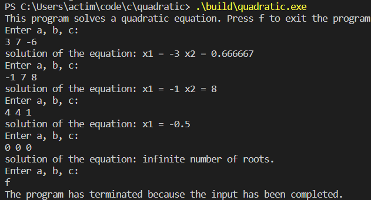

# Quadratic

     

## Description
This program can solve quadratic equations with a real number. Only for Windows OS

## Installation

To use the project, you must have a `g++ compiler` and a `make`
* Clone this repository:
    * `git clone https://github.com/krampu1/square.git`
    * `cd square`
 * Build the program:
    * `make release`

## Usage
To use the program, you must run the `quadratic` file in the `build` folder.

Usage example:

    

