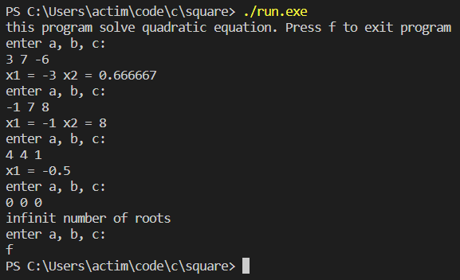
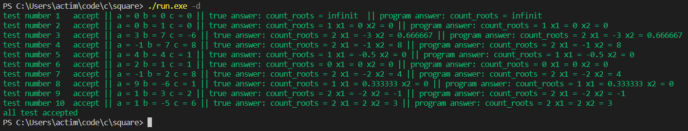

# Quadratic

<p align="center">
     
</p>

## Description
This program can solve quadratic equations.

## Installation
To use a progect you should have ```g++ compiler``` and ```make```
* Clone this repository:
    * `git clone https://github.com/krampu1/square.git`
    * `cd square`
 * Build the program:
    * `make`
 * Clean after work ```make```:
    * `make clean`

## Usage
To use a program you should run `run` file in linux and `run.exe` file in windows.

The program allows you to choose the mode of operation: testing and solving.

For testing: run the program with the -d flag

For solve: just run the program

Usage example:
<p align="center">
    
</p>
<p align="center">
    
</p>